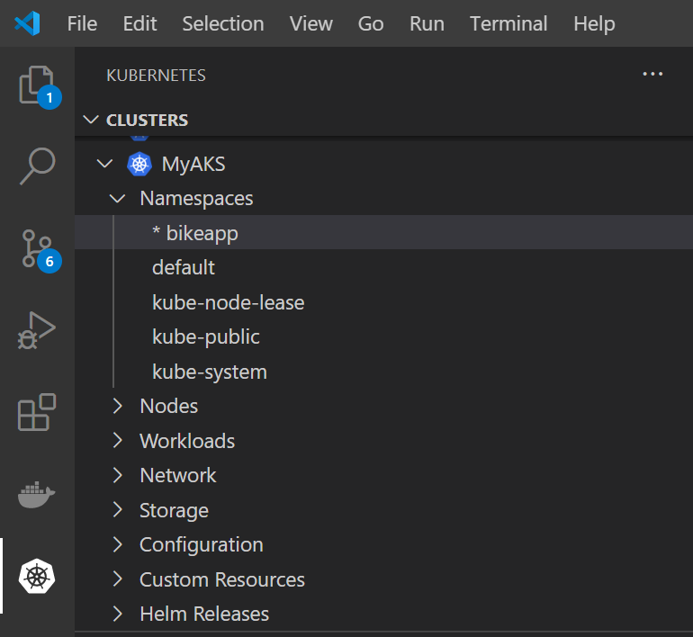
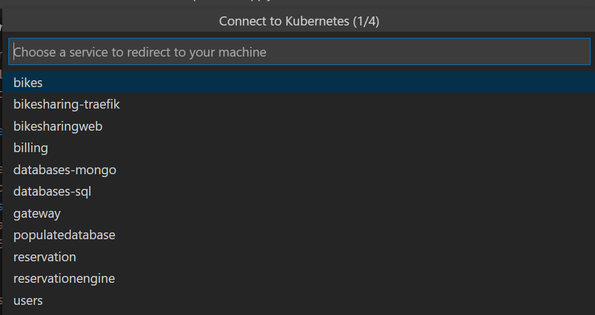
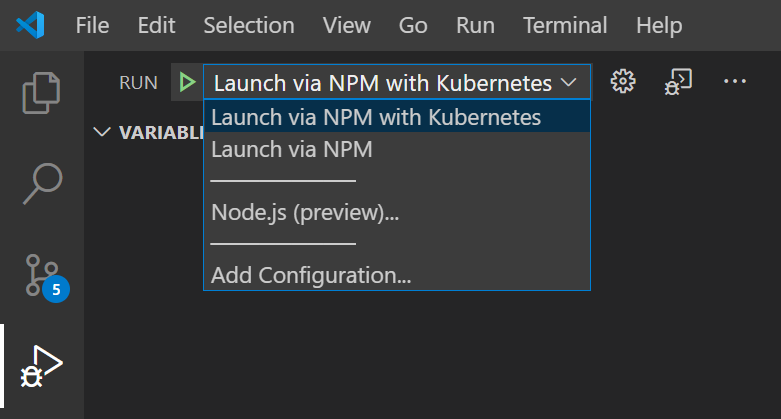
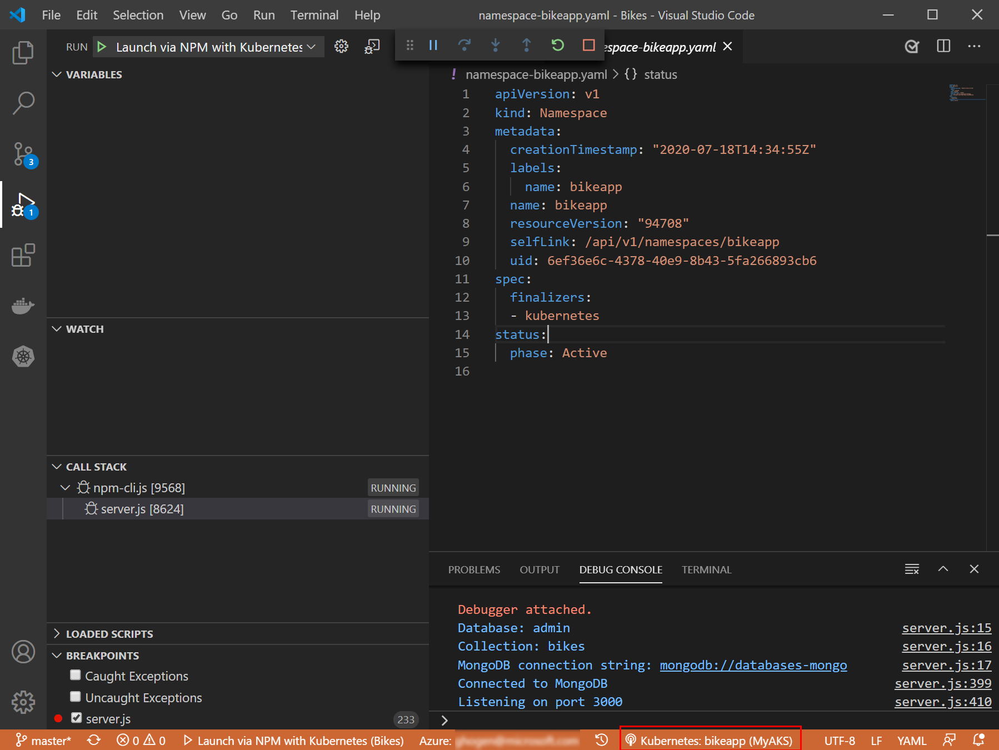
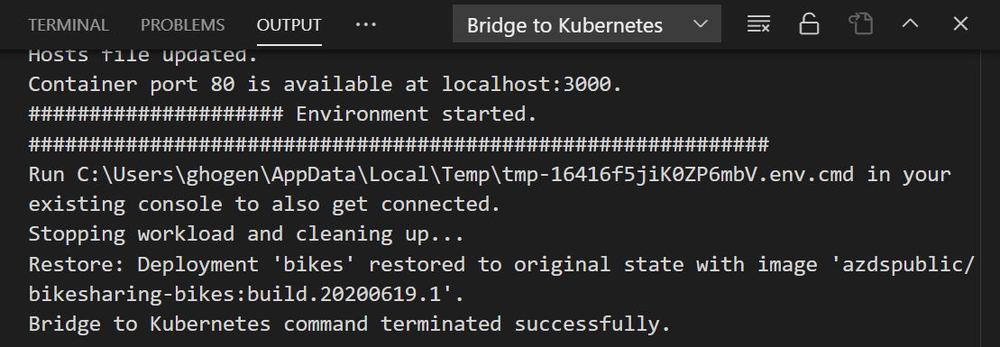
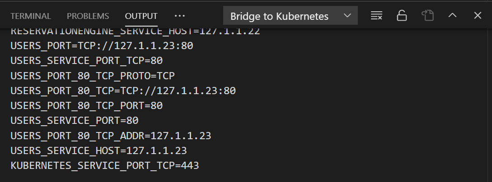

# Use Bridge to Kubernetes with AKS

In this tutorial, you'll use a specific AKS sample microservices web app to learn how to use Bridge to Kubernetes to debug locally in a single pod that's part of an Azure Kubernetes Service (AKS) cluster.

## Before you begin

This guide uses the [Bike Sharing sample application][bike-sharing-github] to demonstrate connecting your development computer to a Kubernetes cluster running in AKS. If you already have your own application running on a Kubernetes cluster, see [Develop with Kubernetes](bridge-to-kubernetes-vs-code.md). If you are using another cluster, such as MiniKube running locally, see [Use Bridge to Kubernetes with a sample](bridge-to-kubernetes-sample.md).

### Prerequisites

* An Azure subscription. If you don't have an Azure subscription, you can create a [free account](https://azure.microsoft.com/free).
* [Azure CLI installed][azure-cli].
* [Visual Studio Code][vs-code] running on macOS, Windows 10, or Linux.
* The [Bridge to Kubernetes][btk-vs-code] extension installed in Visual Studio Code.

## Create a Kubernetes cluster

Create an AKS cluster in a [supported region][supported-regions]. The below commands create a resource group called `MyResourceGroup` and an AKS cluster called `MyAKS`.

```azurecli-interactive
az group create \
    --name MyResourceGroup \
        --location eastus
az aks create \
    --resource-group MyResourceGroup \
    --name MyAKS \
    --location eastus \
    --node-count 3 \
    --generate-ssh-keys
```

## Install the sample application

Install the sample application on your cluster using the provided script. You can run this script on your development computer or using the [Azure Cloud Shell][azure-cloud-shell]. Use the name of your cluster and resource group.

> [!IMPORTANT]
> You must have **Owner** or **Contributor** access to your cluster in order to run the script.

```azurecli-interactive
git clone https://github.com/Microsoft/mindaro
cd mindaro/
chmod +x ./bridge-quickstart.sh
./bridge-quickstart.sh -g MyResourceGroup -n MyAKS
```

Navigate to the sample application running your cluster by opening its public URL, which is displayed in the output of the installation script.

```console
$ ./bridge-quickstart.sh -g MyResourceGroup -n MyAKS
Checking directory /home/<user>/mindaro for GIT repo Microsoft/Mindaro
Setting the Kube context
...
To try out the app, open the url:
bikeapp.bikesharingweb.EXTERNAL_IP.nip.io
```

In the above sample, the public URL is `bikeapp.bikesharingweb.EXTERNAL_IP.nip.io`.

## Connect to your cluster and debug a service

On your development computer, download and configure the Kubernetes CLI to connect to your Kubernetes cluster using [az aks get-credentials][az-aks-get-credentials].

```azurecli
az aks get-credentials --resource-group MyResourceGroup --name MyAKS
```

Open `mindaro/samples/BikeSharingApp/Bikes` from the [Bike Sharing sample application][bike-sharing-github] in Visual Studio Code. Open the Azure Kubernetes Service extension and select the **bikeapp** namespace in the **MyAKS** cluster. Right-click the **bikeapp** node, and choose **Use Namespace**.



Open a terminal window (**Terminal > New Terminal**), and in the terminal window in the **Bikes** folder, use the `npm install` command to install the dependencies for the application.

```console
npm install
```

Open the Command Palette (**CTRL**+**SHIFT**+**P** or **Cmd**+**Shift**+**P** on a Mac), and run the command **Bridge to Kubernetes: Configure** to start the configuration process.

Choose the **bikes** service.



All traffic in the Kubernetes cluster is redirected for the bikes service to the version of your application running in your development computer. Bridge to Kubernetes also routes all outbound traffic from the application back to your Kubernetes cluster.

> [!IMPORTANT]
> You can only redirect services that have a single pod.

After you select your service, you are prompted to enter the TCP port for your local application. For this example, enter "3000".


Choose **Launch via NPM** as the launch task.


> [!NOTE]
> You will be prompted to allow the **EndpointManager** to run elevated and modify your hosts file.

You have the option of running isolated or not isolated. If you run isolated, only your requests are routed to your local process; other developers can use the cluster without being affected. If you don't run isolated, all traffic is redirected to your local process. For more information on this option, see [Using routing capabilities for developing in isolation][btk-overview-routing].


Select the **Debug** icon on the left and select **Launch via NPM with Kubernetes** at the top.



Your development computer is connected when the VS Code status bar turns orange and the Kubernetes extension shows you are connected.



> [!NOTE]
> On subsequent launches, you will not be prompted for the service name, port, launch task, or whether to run isolated. These values are saved in `.vscode/tasks.json`. To change these settings later, open the Command Palette (**CTRL**+**SHIFT**+**P** or **Cmd**+**Shift**+**P** on a Mac), and run the command **Bridge to Kubernetes: Configure**.

Once your development computer is connected, traffic starts redirecting to your development computer for the service you are replacing.

## Set a break point

Open [server.js][server-js-breakpoint] and put your cursor somewhere on line 233. Set a breakpoint with **F9** or selecting **Run** then **Toggle Breakpoint**.

Navigate to the sample application by opening the public URL. Select **Aurelia Briggs (customer)** as the user, then select a bike to rent. Notice the image for the bike does not load. Return to Visual Studio Code and observe line 233 is highlighted. The breakpoint you set has paused the service at line 233. To resume the service, hit **F5** or select **Run** then **Continue**. Return to your browser and verify you see a placeholder image for the bike.

Remove the breakpoint by putting your cursor on line 233 in `server.js` and hitting **F9**.

### Update your application

Edit `server.js` to remove lines 234 and 235:

```javascript
    // Hard code image url *FIX ME*
    theBike.imageUrl = "/static/logo.svg";
```

The section should now look like:

```javascript
    var theBike = result;
    theBike.id = theBike._id;
    delete theBike._id;
```

Save your changes and press **Ctrl**+**Shift**+**F5** (**⇧⌘F5** on a Mac) or select **Run** then **Restart Debugging**. After you are reconnected, refresh your browser and verify that you no longer see a placeholder image for the bike.

Select **Run** then **Stop Debugging** or press **Shift**+**F5** to stop the debugger.

> [!NOTE]
> By default, stopping the debugging task also disconnects your development computer from your Kubernetes cluster. You can change this behavior by searching for **Bridge to Kubernetes: Disconnect After Debugging** in the Visual Studio Code settings and removing the check next to **Disconnect automatically when Debugging ends**. After updating this setting, your development computer will remain connected when you stop and start debugging. To disconnect your development computer from your cluster, click on the Bridge to Kubernetes extension on the status bar then choose **Disconnect current session**.

## Additional configuration

Bridge to Kubernetes can handle routing traffic and replicating environment variables without any additional configuration. If you need to locally replicate services from other namespaces or download any files that are mounted to the container in your Kubernetes cluster, such as a ConfigMap file, you can create a `KubernetesLocalProcessConfig.yaml` to download those files to your development computer. For more information, see [Configure Bridge to Kubernetes][kubernetesLocalProcessConfig-yaml].

## Using logging and diagnostics

Logging output is written to the **Bridge to Kubernetes** window after your development computer is connected to your Kubernetes cluster.



Click on the **Kubernetes** Status bar and choose **Show connection diagnostics information**. This command prints the current environment variables and DNS entries in the logging output.



Additionally, you can find the diagnostic logs in the `Bridge to Kubernetes` directory in your development computer's TEMP directory. On Windows 10, that's in `%TEMP%\Bridge to Kubernetes`. On a Mac, the TEMP directory can be found by running `echo $TMPDIR` from a terminal window. On Linux, it is `/tmp/Bridge to Kubernetes`.

## Running in isolation mode

With Bridge to Kubernetes, you can also set up an isolated version the services you're working on, meaning that others who are using the cluster won't be affected by your changes. This isolation mode is accomplished by routing your requests to your copy of each affected service, but routing all other traffic normally. More explanation on how this is done can be found at [How Bridge to Kubernetes Works][btk-overview-routing].

## Remove the sample application from your cluster

Use the provided script to remove the sample application from your cluster.

```azurecli-interactive
./bridge-quickstart.sh -c -g MyResourceGroup -n MyAKS
```

## Troubleshooting

 If you get this error when activating the Bridge to Kubernetes extension:

"Failed to update dependencies: maximum number of retries exceeded"

 First, retry the activation using the button. If it repeatedly does not succeed, see [https://github.com/microsoft/mindaro/issues/32](https://github.com/microsoft/mindaro/issues/32).

## Next steps

Learn more about Bridge to Kubernetes at [How Bridge to Kubernetes works][btk-how-it-works].

[azure-kubernetes-service]: /azure/aks/kubernetes-walkthrough
[azds-cli]: /azure/dev-spaces/how-to/install-dev-spaces#install-the-client-side-tools
[azds-tmp-dir]: /azure/dev-spaces/troubleshooting#before-you-begin
[btk-vs-code]: https://marketplace.visualstudio.com/items?itemName=mindaro.mindaro
[azure-cli]: /cli/azure/install-azure-cli?view=azure-cli-latest&preserve-view=true
[azure-cloud-shell]: /azure/cloud-shell/overview
[az-aks-get-credentials]: /cli/azure/aks?view=azure-cli-latest&preserve-view=true#az-aks-get-credentials
[az-aks-vs-code]: https://marketplace.visualstudio.com/items?itemName=ms-kubernetes-tools.vscode-aks-tools
[bike-sharing-github]: https://github.com/Microsoft/mindaro
[preview-terms]: https://azure.microsoft.com/support/legal/preview-supplemental-terms/
[server-js-breakpoint]: https://github.com/Microsoft/mindaro/blob/master/samples/BikeSharingApp/Bikes/server.js#L233
[supported-regions]: https://azure.microsoft.com/global-infrastructure/services/?products=kubernetes-service
[troubleshooting]: /azure/dev-spaces/troubleshooting#fail-to-restore-original-configuration-of-deployment-on-cluster
[vs-code]: https://code.visualstudio.com/download
[kubernetesLocalProcessConfig-yaml]: configure-bridge-to-kubernetes.md
[btk-how-it-works]: overview-bridge-to-kubernetes.md
[btk-overview-routing]: overview-bridge-to-kubernetes.md#using-routing-capabilities-for-developing-in-isolation
