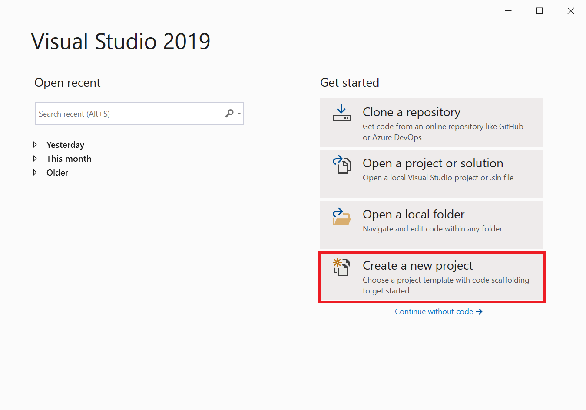
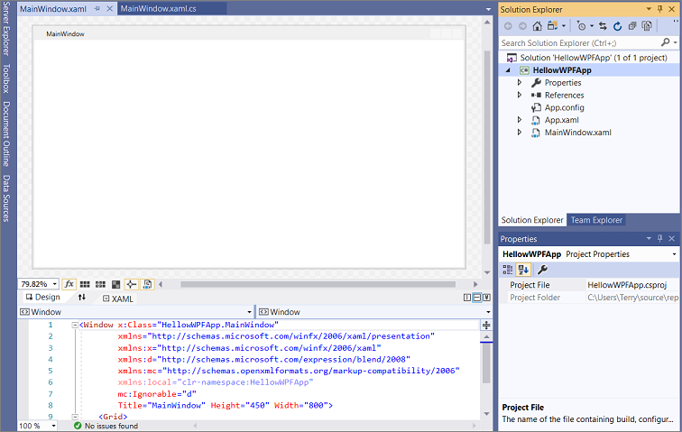
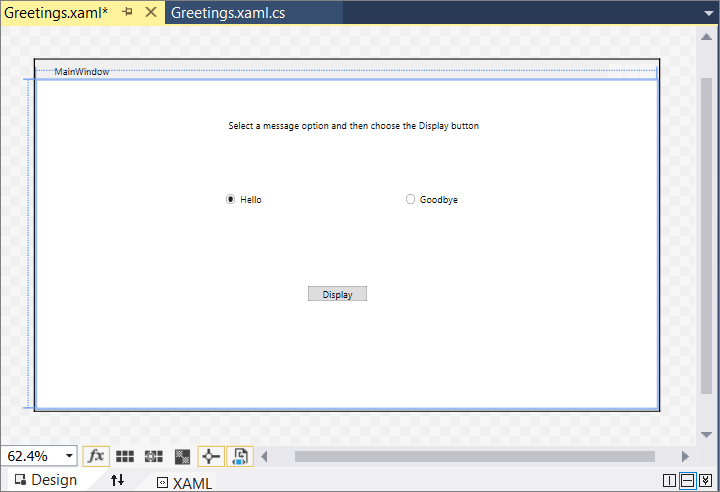
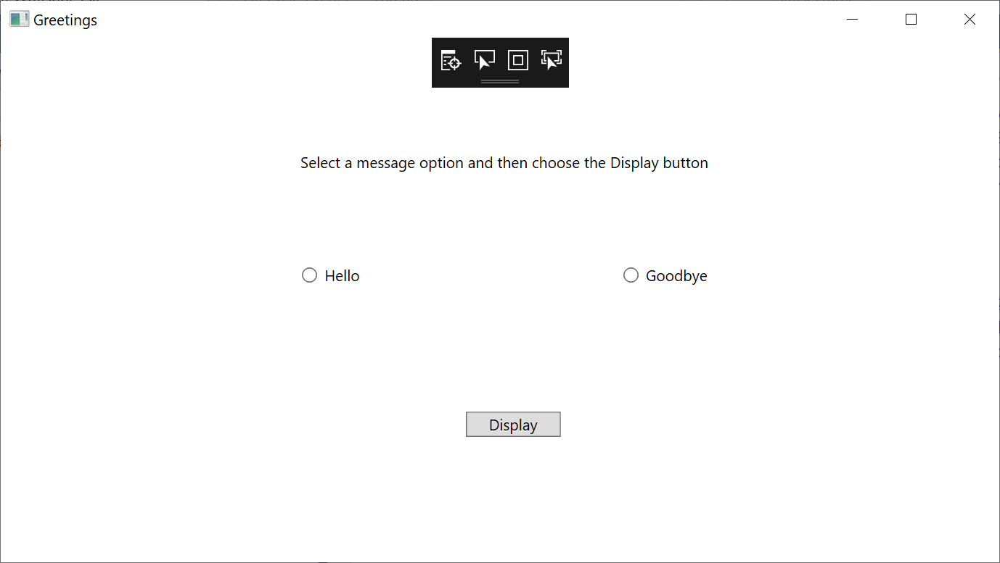
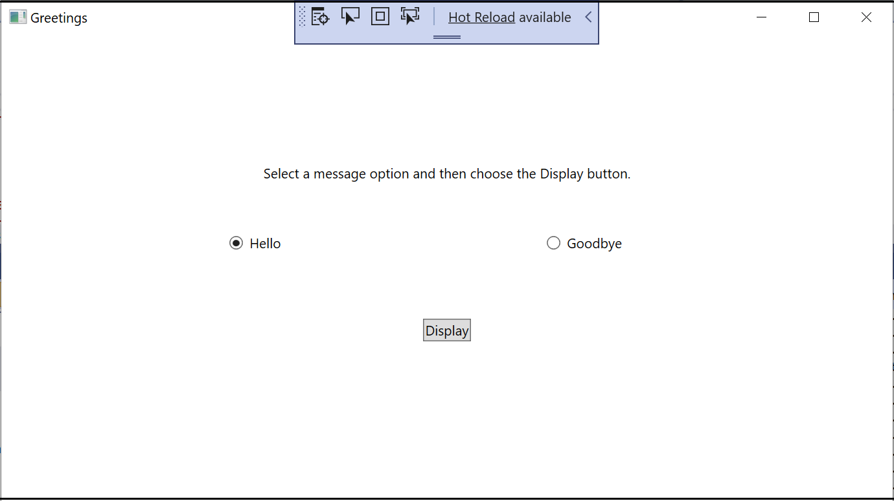
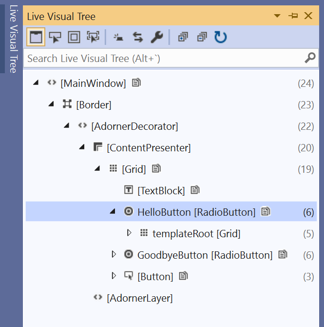

# Tutorial: Create a simple application with C\#

By completing this tutorial, you'll become familiar with many of the tools, dialog boxes, and designers that you can use when you develop applications with Visual Studio. You'll create a "Hello, World" application, design the UI, add code, and debug errors, while you learn about working in the integrated development environment ([IDE](visual-studio-ide.md)).

## Prerequisites

::: moniker range="vs-2017"
If you haven't already installed Visual Studio, go to the [Visual Studio downloads](https://visualstudio.microsoft.com/vs/older-downloads/?) page to install it for free.
::: moniker-end
::: moniker range=">=vs-2019"

- If you haven't already installed Visual Studio, go to the [Visual Studio downloads](https://visualstudio.microsoft.com/downloads/) page to install it for free.
- You can use either .NET Framework or .NET Core for this tutorial. .NET Core is the newer, more modern framework. .NET Core requires Visual Studio 2019 version 16.3 or later.
::: moniker-end

## Configure the IDE

::: moniker range="vs-2017"

When you open Visual Studio for the first time, you'll be prompted to sign in. This step is optional for this tutorial. Next you may be shown a dialog box that asks you to choose your development settings and color theme. Keep the defaults and choose **Start Visual Studio**.


After Visual Studio launches, you'll see tool windows, the menus and toolbars, and the main window space. Tool windows are docked on the left and right sides of the application window, with **Quick Launch**, the menu bar, and the standard toolbar at the top. In the center of the application window is the **Start Page**. When you load a solution or project, editors and designers appear in the space where the **Start Page** is. When you develop an application, you'll spend most of your time in this central area.


::: moniker-end

::: moniker range=">=vs-2019"

When you launch Visual Studio, the start window opens first. Select **Continue without code** to open the development environment. You'll see tool windows, the menus and toolbars, and the main window space. Tool windows are docked on the left and right sides of the application window. The search box, menu bar, and the standard toolbar are located at the top. When you load a solution or project, editors and designers appear in the central space of the application window. When you develop an application, you'll spend most of your time in this central area.

::: moniker-end

## Create the project

When you create an application in Visual Studio, you first create a project and a solution. For this example, you'll create a Windows Presentation Foundation (WPF) project.

::: moniker range="vs-2017"

1. Create a new project. On the menu bar, select **File** > **New** > **Project**.

     

1. In the **New Project** dialog, select the **Installed** > **Visual C#** > **Windows Desktop** category, and then select the **WPF App (.NET Framework)** template. Name the project **HelloWPFApp**, and select **OK**.

     

::: moniker-end

::: moniker range="vs-2019"

1. Open Visual Studio.

1. On the start window, choose **Create new project**.

   

1. On the **Create a new project** screen, search for "WPF," choose **WPF Application**, and then choose **Next**.

   :::image type="content" source="media/vs-2019/explore-ide-new-project-csharp-vs-2019.png" alt-text="Screenshot of the 'Create a new project' dialog with 'WPF' entered in the search box, and the 'WPF Application' project template highlighted.":::

1. At the next screen, give the project a name, **HelloWPFApp**, and choose **Next**.

   :::image type="content" source="./media/vs-2019/explore-ide-name-project.png" alt-text="Screenshot of the 'Configure your new project' dialog with 'HelloWPFApp' entered in the Project name field.":::

1. In the **Additional information** window, **.NET Core 3.1** should already be selected for your target framework. If not, select **.NET Core 3.1**. Then, choose **Create**.

   :::image type="content" source="./media/vs-2019/wpf-target-framework.png" alt-text="In the 'Additional information' window, make sure .NET Core 3.1 is selected":::

Visual Studio creates the HelloWPFApp project and solution, and **Solution Explorer** shows the various files. The **WPF Designer** shows a design view and a XAML view of *MainWindow.xaml* in a split view. You can slide the splitter to show more or less of either view. You can choose to see only the visual view or only the XAML view.



> [!NOTE]
> For more information about XAML (eXtensible Application Markup Language), see the [XAML overview for WPF](/dotnet/framework/wpf/advanced/xaml-overview-wpf) page.

After you create the project, you can customize it. To do so, choose **Properties Window** from the **View** menu, or press **F4**. Then, you can display and change options for project items, controls, and other items in an application.


::: moniker-end

::: moniker range=">=vs-2022"

1. Open Visual Studio.

1. On the start window, choose **Create a new project**.

   :::image type="content" source="media/vs-2022/start-window-create-new-project.png" alt-text="Screenshot of the start window in Visual Studio 2022 with the 'Create a new project' option highlighted.":::

1. On the **Create a new project** screen, search for "WPF," choose **WPF Application**, and then choose **Next**.

   :::image type="content" source="media/vs-2022/explore-ide-new-project-csharp-wpf-vs-2022.png" alt-text="Screenshot of the 'Create a new project' dialog with 'WPF' entered in the search box, and the 'WPF Application' project template highlighted.":::

1. At the next screen, give the project a name, **HelloWPFApp**, and choose **Next**.

   :::image type="content" source="media/vs-2022/explore-ide-name-project.png" alt-text="Screenshot of the 'Configure your new project' dialog with 'HelloWPFApp' entered in the Project name field.":::

1. In the **Additional information** window, **.NET 6.0 (Long-term support)** should already be selected for your target framework. If not, select **.NET 6.0 (Long-term support)**. Then, choose **Create**.

   :::image type="content" source="media/vs-2022/wpf-target-framework.png" alt-text="In the 'Screenshot of the Additional information window with '.NET 6.0 (Long-term support)' selected in the Framework field.":::

Visual Studio creates the HelloWPFApp project and solution, and **Solution Explorer** shows the various files. The **WPF Designer** shows a design view and a XAML view of *MainWindow.xaml* in a split view. You can slide the splitter to show more or less of either view. You can choose to see only the visual view or only the XAML view.

:::image type="content" source="media/vs-2022/explore-ide-wpf-project-cs.png" alt-text="Screenshot of the HelloWPFApp project and solution in the Visual Studio IDE with the Solution Explorer open, and the XAML and designer views of 'MainWindow.xaml' open in the WPF Designer.":::

> [!NOTE]
> For more information about XAML (eXtensible Application Markup Language), see the [XAML overview for WPF](/dotnet/framework/wpf/advanced/xaml-overview-wpf) page.

After you create the project, you can customize it. To do so, choose **Properties Window** from the **View** menu, or press **F4**. Then, you can display and change options for project items, controls, and other items in an application.

:::image type="content" source="media/vs-2022/explore-ide-hello-wpf-properties.png" alt-text="Screenshot of the Properties window showing the Misc section of the Solution Properties for the HelloWPFApp project.":::

::: moniker-end

### Change the name of MainWindow.xaml

Let's give MainWindow a more specific name. In **Solution Explorer**, right-click on *MainWindow.xaml* and choose **Rename**. Rename the file to *Greetings.xaml*.

## Design the user interface (UI)

If the designer is not open, select *Greetings.xaml* and press **Shift**+**F7** to open the designer.

We'll add three types of controls to this application: a <xref:System.Windows.Controls.TextBlock> control, two <xref:System.Windows.Controls.RadioButton> controls, and a <xref:System.Windows.Controls.Button> control.

### Add a TextBlock control

::: moniker range="vs-2019"

1. Press **Ctrl**+**Q** to activate the search box and type **Toolbox**. Choose **View > Toolbox** from the results list.

1. In the **Toolbox**, expand the **Common WPF Controls** node to see the TextBlock control.

     

1. Add a TextBlock control to the design surface by choosing the **TextBlock** item and dragging it to the window on the design surface. Center the control near the top of the window. In Visual Studio 2019 and later, you can use the red guidelines to center the control.

    Your window should resemble the following illustration:

    

   The XAML markup should look something like the following example:

    ```xaml
    <Grid>
        <TextBlock HorizontalAlignment="Left" Margin="387,60,0,0" TextWrapping="Wrap" Text="TextBlock" VerticalAlignment="Top"/>
    </Grid>
    ```

::: moniker-end

::: moniker range=">=vs-2022"

1. Press **Ctrl**+**Q** to activate the search box and type **Toolbox**. Choose **View > Toolbox** from the results list.

1. In the **Toolbox**, expand the **Common WPF Controls** node to see the TextBlock control.

    :::image type="content" source="media/vs-2022/explore-ide-textblock-toolbox.png" alt-text="Screenshot of the Toolbox window with the TextBlock control selected in the list of Common WPF Controls.":::

1. Add a TextBlock control to the design surface by choosing the **TextBlock** item and dragging it to the window on the design surface. Center the control near the top of the window. You can use the guidelines to center the control.

    Your window should resemble the following image:

    :::image type="content" source="media/vs-2022/explore-ide-greetings-with-textblock-only.png" alt-text="Screenshot of the TextBlock control on the design surface. Guidelines are shown for positioning and resizing the control.":::

   The XAML markup should look something like the following example:

    ```xaml
    <Grid>
        <TextBlock HorizontalAlignment="Left" Margin="387,60,0,0" TextWrapping="Wrap" Text="TextBlock" VerticalAlignment="Top"/>
    </Grid>
    ```

::: moniker-end

### Customize the text in the text block

1. In the XAML view, locate the markup for **TextBlock** and change the **Text** attribute from `TextBox` to `Select a message option and then choose the Display button.`

   The XAML markup should look something like the following example:

   ```xaml
   <Grid>
       <TextBlock HorizontalAlignment="Left" Margin="387,60,0,0" TextWrapping="Wrap" Text="Select a message option and then choose the Display button." VerticalAlignment="Top"/>
   </Grid>
   ```

1. Center the TextBlock again if you like, and then save your changes by pressing **Ctrl+S** or using the **File** menu item.

Next, you'll add two [RadioButton](/dotnet/framework/wpf/controls/radiobutton) controls to the form.

### Add radio buttons

::: moniker range="vs-2019"

1. In the **Toolbox**, find the **RadioButton** control.

     

1. Add two RadioButton controls to the design surface by choosing the **RadioButton** item and dragging it to the window on the design surface. Move the buttons (by selecting them and using the arrow keys) so that the buttons appear side by side under the TextBlock control. Use the red guidelines to align the controls.

   Your window should look like this:

   

1. In the **Properties** window for the left RadioButton control, change the **Name** property (the property at the top of the **Properties** window) to `HelloButton`.

    

1. In the **Properties** window for the right RadioButton control, change the **Name** property to `GoodbyeButton`, and then save your changes.

Next, you'll add display text for each RadioButton control. The following procedure updates the **Content** property for a RadioButton control.

::: moniker-end

::: moniker range=">=vs-2022"

1. In the **Toolbox**, find the **RadioButton** control.

   :::image type="content" source="media/vs-2022/explore-ide-radiobutton-toolbox.png" alt-text="Screenshot of the Toolbox window with the RadioButton control selected in the list of Common WPF Controls.":::

1. Add two RadioButton controls to the design surface by choosing the **RadioButton** item and dragging it to the window on the design surface. Move the buttons (by selecting them and using the arrow keys) so that the buttons appear side by side under the TextBlock control. You can use the guidelines to align the controls.

   Your window should look like this:

   :::image type="content" source="media/vs-2022/explore-ide-greetings-with-radiobuttons.png" alt-text="Screenshot of the Design window for Greetings.xaml, showing a TextBlock control and two RadioButton controls positioned on the design surface.":::

1. In the **Properties** window for the left RadioButton control, change the **Name** property (the property at the top of the **Properties** window) to `HelloButton`.

   :::image type="content" source="media/vs-2022/explore-ide-button-properties.png" alt-text="Screenshot of the Properties window for a RadioButton control. The value of the Name property has been changed to 'HelloButton'.":::

1. In the **Properties** window for the right RadioButton control, change the **Name** property to `GoodbyeButton`, and then save your changes.

Next, you'll add display text for each RadioButton control. The following procedure updates the **Content** property for a RadioButton control.

::: moniker-end

### Add display text for each radio button

1. Update the **Content** attribute for the `HelloButton` and `GoodbyeButton` to `"Hello"` and `"Goodbye"` in the XAML. The XAML markup should now look similar to the following example:

   ```xaml
   <Grid>
        <TextBlock HorizontalAlignment="Left" Margin="252,47,0,0" TextWrapping="Wrap" Text="Select a message option and then choose the Display button." VerticalAlignment="Top"/>
        <RadioButton x:Name="HelloButton" Content="Hello" HorizontalAlignment="Left" Margin="297,161,0,0" VerticalAlignment="Top"/>
        <RadioButton x:Name="GoodbyeButton" Content="Goodbye" HorizontalAlignment="Left" Margin="488,161,0,0" VerticalAlignment="Top"/>
   </Grid>
   ```

### Set a radio button to be checked by default

In this step, we'll set HelloButton to be checked by default so that one of the two radio buttons is always selected.

1. In the XAML view, locate the markup for HelloButton.

1. Add an **IsChecked** attribute and set it to **True**. Specifically, add `IsChecked="True"`.

   The XAML markup should now look similar to the following example:

   ```xaml
   <Grid>
        <TextBlock HorizontalAlignment="Left" Margin="252,47,0,0" TextWrapping="Wrap" Text="Select a message option and then choose the Display button." VerticalAlignment="Top"/>
        <RadioButton x:Name="HelloButton" Content="Hello" IsChecked="True" HorizontalAlignment="Left" Margin="297,161,0,0" VerticalAlignment="Top"/>
        <RadioButton x:Name="GoodbyeButton" Content="Goodbye" HorizontalAlignment="Left" Margin="488,161,0,0" VerticalAlignment="Top"/>
   </Grid>
   ```

The final UI element that you'll add is a [Button](/dotnet/framework/wpf/controls/button) control.

### Add the button control

::: moniker range="vs-2019"

1. In the **Toolbox**, find the **Button** control, and then add it to the design surface under the RadioButton controls by dragging it to the form in the design view. If you're using Visual Studio 2019 or later, a red line helps you center the control.

1. In the XAML view, change the value of **Content** for the Button control from `Content="Button"` to `Content="Display"`, and then save the changes.

     Your window should resemble the following illustration.

     

   The XAML markup should now look similar to the following example:

   ```xaml
   <Grid>
        <TextBlock HorizontalAlignment="Left" Margin="252,47,0,0" TextWrapping="Wrap" Text="Select a message option and then choose the Display button." VerticalAlignment="Top"/>
        <RadioButton x:Name="HelloButton" Content="Hello" IsChecked="True" HorizontalAlignment="Left" Margin="297,161,0,0" VerticalAlignment="Top"/>
        <RadioButton x:Name="GoodbyeButton" Content="Goodbye" HorizontalAlignment="Left" Margin="488,161,0,0" VerticalAlignment="Top"/>
        <Button Content="Display" HorizontalAlignment="Left" Margin="377,270,0,0" VerticalAlignment="Top" Width="75"/>
   </Grid>
   ```

::: moniker-end

::: moniker range=">=vs-2022"

1. In the **Toolbox**, find the **Button** control, and then add it to the design surface under the RadioButton controls by dragging it to the form in the design view. The guidelines can help you center the control.

1. In the XAML view, change the value of **Content** for the Button control from `Content="Button"` to `Content="Display"`, and then save the changes.

     Your window should resemble the following screenshot.

     :::image type="content" source="media/vs-2022/explore-ide-greetings-with-control-labels-cs.png" alt-text="Screenshot of the Design window for Greetings.xaml showing a TextBlock control, two RadioButton controls labeled 'Hello' and 'Goodbye', and a button labeled 'Display'.":::

   The XAML markup should now look similar to the following example:

   ```xaml
   <Grid>
        <TextBlock HorizontalAlignment="Left" Margin="252,47,0,0" TextWrapping="Wrap" Text="Select a message option and then choose the Display button." VerticalAlignment="Top"/>
        <RadioButton x:Name="HelloButton" Content="Hello" IsChecked="True" HorizontalAlignment="Left" Margin="297,161,0,0" VerticalAlignment="Top"/>
        <RadioButton x:Name="GoodbyeButton" Content="Goodbye" HorizontalAlignment="Left" Margin="488,161,0,0" VerticalAlignment="Top"/>
        <Button Content="Display" HorizontalAlignment="Left" Margin="377,270,0,0" VerticalAlignment="Top" Width="75"/>
   </Grid>
   ```

::: moniker-end

### Add code to the display button

::: moniker range="vs-2019"

When this application runs, a message box appears after a user chooses a radio button and then chooses the **Display** button. One message box will appear for Hello, and another will appear for Goodbye. To create this behavior, you'll add code to the `Button_Click` event in *Greetings.xaml.cs*.

1. On the design surface, double-click the **Display** button.

     *Greetings.xaml.cs* opens, with the cursor in the `Button_Click` event.

    ```csharp
    private void Button_Click(object sender, RoutedEventArgs e)
    {

    }
    ```

1. Enter the following code:

    ```csharp
    if (HelloButton.IsChecked == true)
    {
         MessageBox.Show("Hello.");
    }
    else if (GoodbyeButton.IsChecked == true)
    {
        MessageBox.Show("Goodbye.");
    }
    ```

1. Save the application.

::: moniker-end

::: moniker range=">=vs-2022"

When this application runs, a message box appears after a user chooses a radio button and then chooses the **Display** button. One message box will appear for Hello, and another will appear for Goodbye. To create this behavior, you'll add code to the `Button_Click` event in *Greetings.xaml.cs*.

1. On the design surface, double-click the **Display** button.

     *Greetings.xaml.cs* opens, with the cursor in the `Button_Click` event.

    ```csharp
    private void Button_Click(object sender, RoutedEventArgs e)
    {

    }
    ```

1. Enter the following code:

    ```csharp
    if (HelloButton.IsChecked == true)
    {
         MessageBox.Show("Hello.");
    }
    else if (GoodbyeButton.IsChecked == true)
    {
        MessageBox.Show("Goodbye.");
    }
    ```

1. Save the application.

::: moniker-end

## Debug and test the application

Next, you'll debug the application to look for errors and test that both message boxes appear correctly. The following instructions tell you how to build and launch the debugger, but later you might read [Build a WPF application (WPF)](/dotnet/framework/wpf/app-development/building-a-wpf-application-wpf) and [Debug WPF](../../debugger/debugging-wpf.md) for more information.

### Find and fix errors

In this step, you'll find the error that we caused earlier by changing the name of the *MainWindow.xaml* file.

#### Start debugging and find the error

::: moniker range="vs-2019"

1. Start the debugger by pressing **F5** or selecting **Debug**, then **Start Debugging**.

   A **Break Mode** window appears, and the **Output** window indicates that an IOException has occurred: Cannot locate resource 'mainwindow.xaml'.

   

1. Stop the debugger by choosing **Debug** > **Stop Debugging**.

We renamed *MainWindow.xaml* to *Greetings.xaml* at the start of this tutorial, but the code still refers to *MainWindow.xaml* as the startup URI for the application, so the project can't start.

::: moniker-end

::: moniker range=">=vs-2022"

1. Start the debugger by pressing **F5** or selecting **Debug**, then **Start Debugging**.

   A **Break Mode** window appears, and the **Output** window indicates that an IOException has occurred: Cannot locate resource 'mainwindow.xaml'.

   :::image type="content" source="media/vs-2022/explore-ide-ioexception.png" alt-text="Screenshot of the Output window showing a System.IO.IOException with the message 'Cannot locate resource mainwindow.xaml'.":::

1. Stop the debugger by choosing **Debug** > **Stop Debugging**.

We renamed *MainWindow.xaml* to *Greetings.xaml* at the start of this tutorial, but the code still refers to *MainWindow.xaml* as the startup URI for the application, so the project can't start.

::: moniker-end
#### Specify Greetings.xaml as the startup URI

1. In **Solution Explorer**, open the *App.xaml* file.

1. Change `StartupUri="MainWindow.xaml"` to `StartupUri="Greetings.xaml"`, and save the changes.

As an optional step, it will avoid confusion to change the title of your application window to match this new name.

1. In **Solution Explorer**, open the *Greetings.xaml* file that you just renamed.

1. Change the value of the  **Window.Title** property from `Title="MainWindow"` to `Title="Greetings"`, and save the changes.

Start the debugger again (press **F5**). You should now see the **Greetings** window of your application.

::: moniker range="vs-2017"

::: moniker-end
::: moniker range="vs-2019"

::: moniker-end
::: moniker range=">=vs-2022"

:::image type="content" source="media/vs-2022/explore-ide-wpf-running-app.png" alt-text="Screenshot of the Greetings window with the TextBlock, RadioButtons, and Button controls visible. The 'Hello' radio button is selected.":::

::: moniker-end

Now close the application window to stop debugging.

### Debug with breakpoints

You can test the code during debugging by adding some breakpoints. You can add breakpoints by choosing **Debug** > **Toggle Breakpoint**, by clicking in the left margin of the editor next to the line of code where you want the break to occur, or by pressing **F9**.

#### Add breakpoints

::: moniker range="vs-2019"

1. Open *Greetings.xaml.cs*, and select the following line: `MessageBox.Show("Hello.")`

1. Add a breakpoint from the menu by selecting **Debug**, then **Toggle Breakpoint**.

     A red circle appears next to the line of code in the far left margin of the editor window.

1. Select the following line: `MessageBox.Show("Goodbye.")`.

1. Press the **F9** key to add a breakpoint, and then press **F5** to start debugging.

1. In the **Greetings** window, choose the **Hello** radio button, and then choose the **Display** button.

    The line `MessageBox.Show("Hello.")` is highlighted in yellow. At the bottom of the IDE, the Autos, Locals, and Watch windows are docked together on the left side, and the Call Stack, Breakpoints, Exception Settings, Command, Immediate, and Output windows are docked together on the right side.

    

1. On the menu bar, choose **Debug** > **Step Out**.

     The application resumes execution, and a message box with the word "Hello" appears.

1. Choose the **OK** button on the message box to close it.

1. In the **Greetings** window, choose the **Goodbye** radio button, and then choose the **Display** button.

     The line `MessageBox.Show("Goodbye.")` is highlighted in yellow.

1. Choose the **F5** key to continue debugging. When the message box appears, choose the **OK** button on the message box to close it.

1. Close the application window to stop debugging.

1. On the menu bar, choose **Debug** > **Disable All Breakpoints**.

::: moniker-end

::: moniker range=">=vs-2022"

1. Open *Greetings.xaml.cs*, and select the following line: `MessageBox.Show("Hello.")`

1. Add a breakpoint from the menu by selecting **Debug**, then **Toggle Breakpoint**.

     A red circle appears next to the line of code in the far left margin of the editor window.

1. Select the following line: `MessageBox.Show("Goodbye.")`.

1. Press the **F9** key to add a breakpoint, and then press **F5** to start debugging.

1. In the **Greetings** window, choose the **Hello** radio button, and then choose the **Display** button.
    
    The line `MessageBox.Show("Hello.")` is highlighted in yellow. At the bottom of the IDE, the Autos, Locals, and Watch windows are docked together on the left side, and the Call Stack, Breakpoints, Exception Settings, Command, Immediate, and Output windows are docked together on the right side.

    :::image type="content" source="media/vs-2022/explore-ide-debug-breakpoint.png" alt-text="Screenshot of a debug session in Visual Studio. The code window for Greetings.xaml.cs shows execution stopped at a breakpoint with a line highlighted in yellow.":::

1. On the menu bar, choose **Debug** > **Step Out**.

     The application resumes execution, and a message box with the word "Hello" appears.

1. Choose the **OK** button on the message box to close it.

1. In the **Greetings** window, choose the **Goodbye** radio button, and then choose the **Display** button.

     The line `MessageBox.Show("Goodbye.")` is highlighted in yellow.

1. Choose the **F5** key to continue debugging. When the message box appears, choose the **OK** button on the message box to close it.

1. Close the application window to stop debugging.

1. On the menu bar, choose **Debug** > **Disable All Breakpoints**.

::: moniker-end

### View a representation of the UI elements

In the running app, you should see a widget that appears at the top of your window. The widget is a runtime helper that provides quick access to some helpful debugging features. Select the first button, **Go to Live Visual Tree**. You should see a window with a tree that contains all the visual elements of your page. Expand the nodes to find the buttons you added.

::: moniker range="vs-2019"

::: moniker-end
::: moniker range=">=vs-2022"

:::image type="content" source="media/vs-2022/explore-ide-live-visual-tree.png" alt-text="Screenshot of the Live Visual Tree window, showing the tree of visual elements in HelloWPFApp.exe while it is running.":::

::: moniker-end
### Build a release version of the application

Now that you've verified that everything works, you can prepare a release build of the application.

1. On the main menu, select **Build** > **Clean solution** to delete intermediate files and output files that were created during previous builds. This step isn't required, but it cleans up the debug build outputs.

1. Change the build configuration for HelloWPFApp from **Debug** to **Release** by using the dropdown control on the toolbar (it says "Debug" currently).

1. Build the solution by choosing **Build** > **Build Solution**.

Congratulations on completing this tutorial! You can find the *.exe* you built under your solution and project directory (*...\HelloWPFApp\HelloWPFApp\bin\Release*).

## Next steps

Congratulations on completing this tutorial! To learn even more, continue with the following tutorials.

> [!div class="nextstepaction"]
> [Continue with more WPF tutorials](/dotnet/framework/wpf/getting-started/wpf-walkthroughs/)

## See also

- [Productivity tips](../../ide/productivity-features.md)
